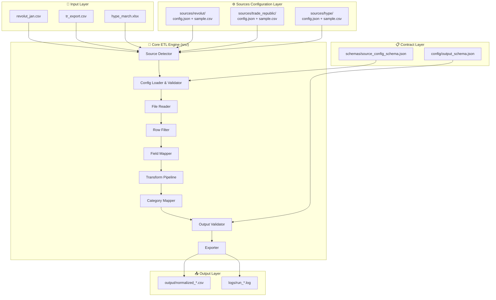
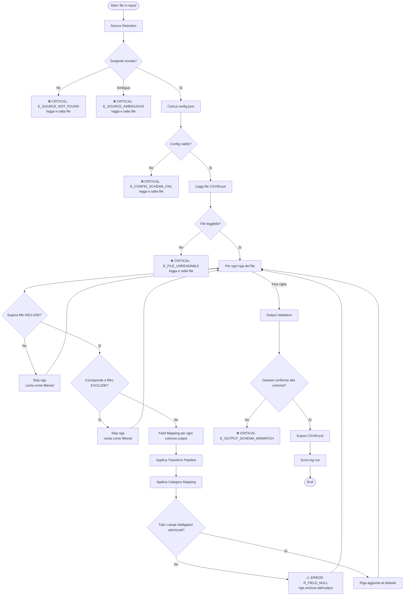
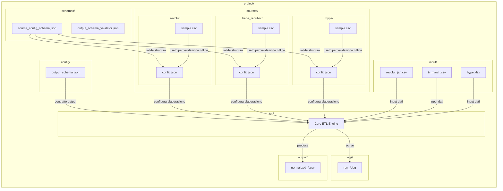
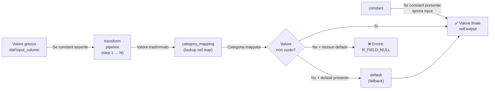

# Software Design Document
## Transaction Normalizer — Sistema ETL Locale JSON-Driven

**Versione:** 1.0.0  
**Data:** 2026-06-27  
**Stato:** Draft — Pronto per implementazione  
**Classificazione:** Specifica tecnica interna

---

## Indice

1. [Introduzione e Obiettivo](#1-introduzione-e-obiettivo)
2. [Principi Architetturali](#2-principi-architetturali)
3. [Struttura del File System](#3-struttura-del-file-system)
4. [Output Schema Standard](#4-output-schema-standard)
5. [Configurazione Sorgente — Design Completo](#5-configurazione-sorgente--design-completo)
6. [Flusso ETL Dettagliato](#6-flusso-etl-dettagliato)
7. [Source Detection Logic](#7-source-detection-logic)
8. [Validation System](#8-validation-system)
9. [Error Handling Model](#9-error-handling-model)
10. [Design Principles — Motivazioni](#10-design-principles--motivazioni)
11. [Estensibilità del Sistema](#11-estensibilità-del-sistema)
12. [Esempi JSON Completi](#12-esempi-json-completi)
13. [Diagrammi di Sistema](#13-diagrammi-di-sistema)
14. [Evoluzioni Future](#14-evoluzioni-future)

---

## 1. Introduzione e Obiettivo

### 1.1 Contesto

Le istituzioni finanziarie (banche, fintech, broker) producono estratti conto in formati eterogenei: colonne con nomi diversi, codifiche di date differenti, separatori decimali non standard, categorie proprietarie, encoding diversi. Un utente che gestisce conti su più istituti deve manualmente riconciliare queste differenze prima di poter analizzare le proprie finanze.

### 1.2 Obiettivo del Sistema

Il sistema **Transaction Normalizer** è un pipeline ETL (Extract, Transform, Load) completamente locale che:

- **Importa** file CSV e/o Excel prodotti da differenti istituti finanziari
- **Normalizza** ogni dataset verso uno schema di output unico e predefinito
- **Applica** trasformazioni configurabili su ogni campo (formattazione date, normalizzazione importi, ecc.)
- **Mappa** le categorie proprietarie di ogni banca verso categorie standard condivise
- **Filtra** le righe indesiderate secondo regole dichiarative configurabili per sorgente
- **Esporta** un dataset finale uniforme pronto per analisi, visualizzazione o importazione in altri tool

### 1.3 Vincoli di Sistema

| Vincolo | Descrizione |
|---|---|
| Esecuzione locale | Nessun dato finanziario lascia la macchina locale. Nessun cloud, nessuna API esterna. |
| Zero hardcoding per sorgente | Aggiungere una nuova banca non richiede modifiche al codice sorgente. |
| Configurazione dichiarativa | Ogni comportamento specifico per sorgente è espresso in JSON, non in codice. |
| Schema output fisso | Esiste un unico contratto di output. Tutte le sorgenti producono lo stesso schema. |
| Modalità batch | Il sistema elabora file già presenti su disco. Non si interfaccia in tempo reale con API bancarie. |

---

## 2. Principi Architetturali

### 2.1 Configuration-Driven Architecture

Il sistema è **100% configuration-driven**. Questo significa che:

- La logica del core ETL è universale e non conosce nessuna banca specifica.
- Ogni comportamento banca-specifico (nomi colonne, formati data, categorie, filtri) è interamente dichiarato in un file `config.json` associato alla sorgente.
- Aggiungere una nuova banca equivale a creare una nuova cartella con un file `config.json`. Non si apre mai un file `.py`, `.ts` o simile.

### 2.2 Output-Driven Mapping

La filosofia di mapping è **orientata all'output**, non all'input. Ogni regola di configurazione descrive *come produrre una colonna del dataset finale*, non *cosa fare con una colonna dell'input*.

Questo è un principio critico: il sistema non chiede "ho questa colonna in input, cosa ne faccio?" ma chiede "questa colonna di output, dove la trovo nell'input e come la trasformo?". La conseguenza è che lo schema di output è il contratto invariante del sistema, e ogni sorgente si adatta ad esso.

### 2.3 Per-Source Isolation

Ogni sorgente è incapsulata nella propria cartella e nel proprio `config.json`. Le sorgenti non si conoscono tra loro. Il sistema core non mantiene stato condiviso tra l'elaborazione di una sorgente e l'altra. Questo garantisce che un errore di configurazione su una sorgente non contamini l'elaborazione delle altre.

### 2.4 Declarative Over Imperative

Tutte le regole (filtri, trasformazioni, mapping) devono essere esprimibili in JSON senza richiedere logica procedurale personalizzata. Quando una trasformazione non è direttamente supportata dalla pipeline standard, il meccanismo corretto è estendere il catalogo delle trasformazioni disponibili nel core, non scrivere logica custom nel config.

---

## 3. Struttura del File System

### 3.1 Layout Completo

```
project/
├── config/
│   └── output_schema.json          ← Contratto unico di output (immutabile a runtime)
│
├── sources/                        ← Una sottocartella per ogni istituto finanziario
│   ├── revolut/
│   │   ├── config.json             ← Configurazione completa della sorgente Revolut
│   │   └── sample.csv              ← File CSV di esempio (usato per validazione offline)
│   │
│   ├── trade_republic/
│   │   ├── config.json
│   │   └── sample.csv
│   │
│   └── hype/
│       ├── config.json
│       └── sample.csv
│
├── input/                          ← Cartella di drop: qui si depositano i file da elaborare
│   ├── revolut_2024_01.csv
│   ├── tr_export_march.csv
│   └── hype_estratto.xlsx
│
├── output/                         ← Dataset normalizzati prodotti dal sistema
│   ├── normalized_2024_01_15.csv
│   └── normalized_2024_01_15.xlsx
│
├── logs/                           ← Log di ogni esecuzione
│   ├── run_2024_01_15_143022.log
│   └── run_2024_01_15_143022_errors.log
│
├── schemas/                        ← JSON Schema per validazione struttura config.json
│   ├── source_config_schema.json   ← Definisce il contratto strutturale di ogni config.json
│   └── output_schema_validator.json
│
└── src/                            ← Codice sorgente del core ETL (non toccare per aggiungere banche)
```

### 3.2 Ruolo di Ogni Directory

| Directory | Ruolo | Modificabile dall'utente finale |
|---|---|---|
| `config/` | Definisce lo schema di output globale. Invariante a runtime. | No (solo in fase di redesign architetturale) |
| `sources/` | Contiene tutte le configurazioni per sorgente. | Sì — aggiungere cartelle/config per nuove banche |
| `input/` | Drop zone per i file grezzi da elaborare. | Sì — si depositano i file qui |
| `output/` | Risultati del sistema. Generati automaticamente. | No — output di sola lettura |
| `logs/` | Traccia di ogni run. Generati automaticamente. | No |
| `schemas/` | JSON Schema per validazione struttura dei config. Invariante. | No |
| `src/` | Codice core del sistema. | No — nessuna modifica per aggiungere sorgenti |

### 3.3 Regola di Naming delle Cartelle Sorgente

Il nome della cartella sotto `sources/` è l'**identificatore canonico** della sorgente. Questo identificatore:

- È usato per il source detection (vedi sezione 7)
- Viene automaticamente assegnato al campo `Conto` se non diversamente configurato
- Appare nei log di sistema per tracciabilità
- È case-insensitive nel processo di matching

---

## 4. Output Schema Standard

### 4.1 Definizione

Il file `config/output_schema.json` definisce il **contratto unico e immutabile** del sistema. Tutte le sorgenti devono produrre esattamente questo schema.

### 4.2 Campi Standard

| Campo | Tipo | Descrizione | Obbligatorio |
|---|---|---|---|
| `Data` | String (ISO 8601: `YYYY-MM-DD`) | Data della transazione | Sì |
| `Acquisto` | String | Descrizione dell'acquisto/transazione | Sì |
| `Importo` | Decimal (2 cifre decimali, punto come separatore) | Importo della transazione. Negativo = uscita, positivo = entrata | Sì |
| `Categoria` | String (enum con emoji) | Categoria della transazione con emoji (es. "🍲 Spesa", "🚌 Trasporti") | Sì |
| `Tag` | String | Tag libero per ulteriore categorizzazione | Sì |
| `Wallet` | String (enum) | Wallet/portafoglio (Hype, Revolut, Contanti, Satispay, Sella, Trade Republic) | Sì |
| `Note` | String | Note aggiuntive libere sulla transazione | Sì |

### 4.3 Invarianti di Output

- **Nessun campo aggiuntivo** è presente nel dataset finale oltre a quelli dichiarati nello schema.
- **Nessun campo è opzionale**: ogni riga del dataset finale deve avere tutti e 7 i campi valorizzati.
- Se un campo non può essere valorizzato, la riga è considerata **invalida** e va in errore, non viene inclusa nell'output.
- Il separatore decimale nell'output è sempre il **punto** (`.`), indipendentemente dal locale del sistema.
- Il formato data nell'output è sempre **ISO 8601** (`YYYY-MM-DD`).
- Le categorie devono essere una dei valori enum predefiniti con emoji.
- Il wallet deve essere uno dei valori enum predefiniti.

---

## 5. Configurazione Sorgente — Design Completo

### 5.1 Struttura Generale di `config.json`

Ogni `sources/<bank>/config.json` ha la seguente struttura di primo livello:

```
{
  "source": { ... },          ← Identità e metadati della sorgente
  "file": { ... },            ← Parametri di lettura del file (encoding, separatore, ecc.)
  "filters": { ... },         ← Regole di inclusione/esclusione delle righe
  "fields": { ... }           ← Mapping output-driven dei campi
}
```

---

### 5.2 Sezione `source` — Identità della Sorgente

La sezione `source` contiene i metadati identificativi della sorgente.

**Proprietà:**

| Chiave | Tipo | Obbligatoria | Descrizione |
|---|---|---|---|
| `name` | String | Sì | Nome display della sorgente (es. `"Revolut"`) |
| `version` | String | No | Versione del file di configurazione (es. `"1.2"`) — utile per audit |
| `description` | String | No | Descrizione testuale della sorgente |

**Nota di design:** Il campo `name` non viene usato per il source detection (che avviene tramite nome cartella), ma è usato esclusivamente nei log e nel campo `Conto` se non è presente un mapping esplicito per quel campo.

---

### 5.3 Sezione `file` — Parametri di Lettura

La sezione `file` descrive come leggere fisicamente il file grezzo della sorgente.

**Proprietà:**

| Chiave | Tipo | Obbligatoria | Default | Descrizione |
|---|---|---|---|---|
| `format` | Enum: `csv`, `xlsx`, `xls` | Sì | — | Formato del file di input |
| `encoding` | String | No | `utf-8` | Encoding del file (es. `utf-8`, `latin-1`, `utf-8-sig`) |
| `delimiter` | String | No | `,` | Separatore di colonne per CSV (es. `,`, `;`, `\t`) |
| `skip_rows` | Integer | No | `0` | Numero di righe da saltare prima dell'header |
| `header_row` | Integer | No | `0` | Indice (0-based) della riga di header dopo il salto |
| `sheet_name` | String / Integer | No | `0` | Foglio da leggere per file Excel (nome o indice 0-based) |
| `decimal_separator` | String | No | `.` | Separatore decimale usato nel file sorgente (es. `,` per formato europeo) |
| `thousands_separator` | String | No | `""` | Separatore delle migliaia usato nel file sorgente (es. `.` o `,`) |
| `date_format` | String | No | `auto` | Pattern strftime per parsing date (es. `%d/%m/%Y`). `auto` tenta detection automatica. |
| `quotechar` | String | No | `"` | Carattere di quoting per CSV |

---

### 5.4 Sezione `filters` — Regole di Filtraggio Righe

La sezione `filters` controlla quali righe del file di input vengono elaborate e quali vengono scartate. Il filtraggio avviene **prima** del mapping e delle trasformazioni, sui dati grezzi dell'input.

#### 5.4.1 Struttura

```
"filters": {
  "include": [ <rule>, <rule>, ... ],
  "exclude": [ <rule>, <rule>, ... ]
}
```

**Semantica:**
- Le regole `include`, se presenti, formano una condizione AND: la riga viene elaborata **solo se soddisfa TUTTE le regole** di include.
- Le regole `exclude`, se presenti, formano una condizione OR: la riga viene **scartata se soddisfa ALMENO UNA** regola di exclude.
- L'exclude viene valutato DOPO l'include. Una riga che supera l'include ma corrisponde a un exclude viene scartata.
- Se `include` è assente o vuoto, tutte le righe passano il filtro include.
- Se `exclude` è assente o vuoto, nessuna riga viene scartata dall'exclude.

#### 5.4.2 Struttura di una Regola Filtro

Ogni regola è un oggetto JSON con le seguenti chiavi:

| Chiave | Tipo | Obbligatoria | Descrizione |
|---|---|---|---|
| `column` | String | Sì | Nome della colonna di input (non output) su cui applicare il filtro |
| `operator` | Enum (vedi 5.4.3) | Sì | Operatore di confronto |
| `value` | Any | Condizionale | Valore di confronto (richiesto per tutti gli operatori eccetto quelli unari) |
| `case_sensitive` | Boolean | No (default: `false`) | Se `true`, il confronto stringa è case-sensitive |

#### 5.4.3 Operatori Supportati

| Operatore | Tipo valore | Descrizione |
|---|---|---|
| `equals` | Scalar | La cella è esattamente uguale al valore |
| `not_equals` | Scalar | La cella è diversa dal valore |
| `in` | Array | La cella è contenuta nell'array di valori |
| `not_in` | Array | La cella non è contenuta nell'array di valori |
| `contains` | String | La cella contiene la sottostringa |
| `not_contains` | String | La cella non contiene la sottostringa |
| `starts_with` | String | La cella inizia con il valore |
| `ends_with` | String | La cella termina con il valore |
| `regex` | String (pattern) | La cella soddisfa l'espressione regolare |
| `gt` | Numeric | La cella è strettamente maggiore del valore |
| `gte` | Numeric | La cella è maggiore o uguale al valore |
| `lt` | Numeric | La cella è strettamente minore del valore |
| `lte` | Numeric | La cella è minore o uguale al valore |
| `is_empty` | — | La cella è vuota o null (nessun `value` richiesto) |
| `is_not_empty` | — | La cella non è vuota o null (nessun `value` richiesto) |

---

### 5.5 Sezione `fields` — Mapping Output-Driven

La sezione `fields` è il cuore del config. Definisce come produrre **ogni colonna dell'output** partendo dai dati grezzi della sorgente.

#### 5.5.1 Struttura Generale

```
"fields": {
  "Data": { <field_definition> },
  "Descrizione": { <field_definition> },
  "Importo": { <field_definition> },
  "Categoria": { <field_definition> },
  "Conto": { <field_definition> },
  "Valuta": { <field_definition> },
  "Tipo": { <field_definition> }
}
```

Le chiavi di primo livello di `fields` sono **sempre e solo** i nomi delle colonne di output definite in `output_schema.json`. Non sono mai nomi di colonne di input.

#### 5.5.2 Struttura di una Field Definition

Ogni definizione di campo supporta le seguenti proprietà:

| Chiave | Tipo | Descrizione | Precedenza |
|---|---|---|---|
| `constant` | Scalar | Valore statico fisso. Se presente, **ignora qualsiasi altra fonte**. | 1 (massima) |
| `input_column` | String | Nome della colonna di input da leggere | 2 |
| `input_columns` | Array di String | Lista di colonne di input da concatenare (richiede `concat_separator`) | 2 (alternativa a `input_column`) |
| `concat_separator` | String | Separatore usato nella concatenazione di `input_columns` | — |
| `transform` | Array di Transform Object | Pipeline ordinata di trasformazioni da applicare al valore | 3 |
| `category_mapping` | Category Mapping Object | Configurazione del mapping categoria (solo per il campo `Categoria`) | 4 |
| `default` | Scalar | Valore di fallback se il risultato finale è null o vuoto | 5 (minima) |

**Regola di precedenza:**
Se è presente `constant`, il campo viene sempre valorizzato con quel valore e le altre proprietà vengono ignorate. Se invece è assente, il sistema legge dall'`input_column` (o concatena gli `input_columns`), applica la pipeline `transform`, applica eventuale `category_mapping`, e infine usa `default` se il risultato è ancora vuoto.

---

### 5.6 Transform Pipeline — Catalogo Completo

La `transform` pipeline è una **lista ordinata** di oggetti di trasformazione. Ogni trasformazione prende il valore corrente e produce un nuovo valore che viene passato alla trasformazione successiva.

#### 5.6.1 Struttura di un Oggetto Transform

Ogni oggetto transform ha:
- `type`: identificatore della trasformazione (string, obbligatoria)
- Eventuali parametri specifici della trasformazione (dipendono dal `type`)

#### 5.6.2 Catalogo delle Trasformazioni

| `type` | Parametri | Descrizione |
|---|---|---|
| `trim` | — | Rimuove spazi iniziali e finali |
| `lowercase` | — | Converte in minuscolo |
| `uppercase` | — | Converte in maiuscolo |
| `titlecase` | — | Prima lettera maiuscola per ogni parola |
| `date_format` | `input_format`: String, `output_format`: String | Converte il formato data. Usa pattern strftime. `output_format` default: `%Y-%m-%d` |
| `number_normalize` | `decimal_separator`: String, `thousands_separator`: String | Normalizza un numero in formato locale a float standard. Rimuove il separatore migliaia, sostituisce il separatore decimale con il punto. |
| `number_abs` | — | Restituisce il valore assoluto del numero |
| `number_negate` | — | Nega il segno del numero (moltiplica per -1) |
| `number_round` | `decimals`: Integer | Arrotonda a N cifre decimali |
| `regex_extract` | `pattern`: String, `group`: Integer (default: 1) | Estrae il gruppo N di una regex applicata al valore |
| `regex_replace` | `pattern`: String, `replacement`: String | Sostituisce il match della regex con la stringa di sostituzione |
| `replace` | `find`: String, `replacement`: String | Sostituisce una sottostringa esatta |
| `replace_map` | `map`: Object (String → String) | Sostituisce il valore esatto secondo un dizionario |
| `concat` | `values`: Array, `separator`: String | Concatena una lista di valori statici o riferimenti a colonne con un separatore. Riferimenti a colonne si esprimono come `"$NomeColonna"`. |
| `strip_chars` | `chars`: String | Rimuove i caratteri specificati da inizio e fine del valore |
| `split_take` | `separator`: String, `index`: Integer | Divide il valore per separatore e prende l'elemento all'indice specificato |
| `coalesce` | `columns`: Array di String | Restituisce il primo valore non-vuoto tra le colonne di input elencate |
| `conditional` | `conditions`: Array di Condition Object | Restituisce un valore diverso in base a condizioni sul valore corrente o su altre colonne (vedi 5.6.3) |
| `sign_from_column` | `column`: String, `positive_values`: Array, `negative_values`: Array | Determina il segno dell'importo leggendo il valore di una colonna indicatrice (es. una colonna "Tipo" con valori "Addebito"/"Accredito") |

#### 5.6.3 Struttura di `conditional` Transform

La trasformazione `conditional` supporta logica if/else dichiarativa:

```
{
  "type": "conditional",
  "conditions": [
    {
      "if_column": "<nome colonna input>",
      "operator": "<operatore>",
      "value": "<valore>",
      "then": "<valore da restituire se condizione vera>"
    }
  ],
  "else": "<valore da restituire se nessuna condizione è soddisfatta>"
}
```

Le condizioni sono valutate nell'ordine in cui sono definite. Viene usato il `then` della **prima** condizione che risulta vera. Se nessuna condizione è vera, viene restituito `else`. Il campo `if_column` fa riferimento a **colonne di input**, non di output.

---

### 5.7 Category Mapping — Design

Il mapping delle categorie è una sotto-configurazione del campo `Categoria` nella sezione `fields`.

#### 5.7.1 Struttura

```json
"Categoria": {
  "input_column": "<colonna input con la categoria grezza>",
  "category_mapping": {
    "map": {
      "<valore grezzo 1>": "<categoria standard>",
      "<valore grezzo 2>": "<categoria standard>",
      ...
    },
    "case_sensitive": false,
    "default": "<categoria di fallback>"
  }
}
```

#### 5.7.2 Proprietà del Category Mapping

| Chiave | Tipo | Obbligatoria | Descrizione |
|---|---|---|---|
| `map` | Object (String → String) | Sì | Dizionario di traduzione categoria grezza → categoria standard |
| `case_sensitive` | Boolean | No (default: `false`) | Se `false`, il lookup è case-insensitive |
| `default` | String | Sì | Categoria di fallback per valori non presenti nel `map`. La sua assenza è un **validation error**. |
| `trim_before_match` | Boolean | No (default: `true`) | Se `true`, il valore viene trimmed prima del lookup |

#### 5.7.3 Interazione con Transform Pipeline

Se è presente sia `transform` che `category_mapping` sullo stesso campo, l'ordine di applicazione è:

1. Lettura del valore grezzo dalla `input_column`
2. Applicazione della pipeline `transform` (se presente)
3. Applicazione del `category_mapping` (se presente)
4. Uso del `default` se il risultato è ancora vuoto

Questo permette, ad esempio, di fare un `trim` e un `lowercase` prima del lookup nel dizionario categorie.

---

## 6. Flusso ETL Dettagliato

### 6.1 Overview delle Fasi

Il sistema esegue il seguente flusso per ogni file nella cartella `input/`:

```
FASE 1: Discovery         → Identificazione di tutti i file di input disponibili
FASE 2: Source Detection  → Associazione di ogni file alla sorgente corretta
FASE 3: Config Loading    → Caricamento e validazione del config.json della sorgente
FASE 4: File Reading      → Lettura del file grezzo con i parametri della sezione `file`
FASE 5: Row Filtering     → Applicazione delle regole `filters` ai dati grezzi
FASE 6: Field Mapping     → Applicazione della sezione `fields` (mapping + transform + category)
FASE 7: Output Validation → Verifica che il dataset prodotto rispetti lo schema di output
FASE 8: Export            → Scrittura del dataset normalizzato nell'output
FASE 9: Logging           → Scrittura del report di run nel log
```

### 6.2 Dettaglio Fase 1 — Discovery

Il sistema scansiona la cartella `input/` e raccoglie tutti i file con estensione `.csv`, `.xlsx`, `.xls`. I file vengono ordinati per nome (per garantire determinismo nell'ordine di elaborazione). I file senza estensione supportata vengono loggati come warning e ignorati.

### 6.3 Dettaglio Fase 2 — Source Detection

Per ogni file trovato, il sistema tenta di identificare la sorgente di appartenenza. Il processo è descritto in dettaglio nella sezione 7.

### 6.4 Dettaglio Fase 3 — Config Loading

Una volta identificata la sorgente, il sistema:

1. Carica il file `sources/<source_name>/config.json`
2. Valida la struttura del config contro lo schema in `schemas/source_config_schema.json`
3. Valida la coerenza del config (tutte le colonne di output sono mappate, tutti gli `input_column` esistono nel sample, ecc. — vedi sezione 8)
4. Se la validazione strutturale fallisce → **critical error**, il file non viene elaborato
5. Se la validazione di coerenza produce warning → il sistema continua ma logga i warning

### 6.5 Dettaglio Fase 4 — File Reading

Il sistema legge il file grezzo usando i parametri della sezione `file` del config:

- **CSV**: usa `delimiter`, `encoding`, `skip_rows`, `header_row`, `quotechar`
- **Excel**: usa `sheet_name`, `skip_rows`, `header_row`

Dopo la lettura, tutte le colonne vengono mantenute come stringhe grezze. La conversione di tipo avviene durante la fase di Field Mapping tramite le transform, non in questa fase. Questo garantisce che i dati grezzi siano sempre accessibili per il debugging.

Se il file non può essere letto (file corrotto, encoding errato, ecc.) → **critical error** per quel file specifico. Gli altri file continuano ad essere elaborati.

### 6.6 Dettaglio Fase 5 — Row Filtering

Le regole di filtraggio vengono applicate ai dati grezzi (valori stringa non trasformati).

**Ordine di valutazione per ogni riga:**

1. Valutare tutte le regole `include` (AND logico)
   - Se almeno una regola include non è soddisfatta → riga scartata (logga come "skipped by include filter")
2. Valutare tutte le regole `exclude` (OR logico)
   - Se almeno una regola exclude è soddisfatta → riga scartata (logga come "skipped by exclude filter")
3. Se la riga supera entrambi i filtri → procede alla fase di Field Mapping

Le righe scartate vengono conteggiate nel log finale della run. Non sono considerate errori.

### 6.7 Dettaglio Fase 6 — Field Mapping

Per ogni riga che ha superato il filtraggio, il sistema costruisce una riga di output iterando su ogni campo dell'output schema.

Per ogni campo di output, la sequenza di applicazione è:

```
1. Se config[field].constant è presente → usa il valore costante, salta al prossimo campo
2. Se config[field].input_columns è presente → concatena i valori delle colonne con concat_separator
   Altrimenti → leggi il valore da config[field].input_column
3. Se config[field].transform è presente → applica ogni step della pipeline nell'ordine
4. Se config[field].category_mapping è presente → fai il lookup nel dizionario
5. Se il valore è ancora null/vuoto AND config[field].default è presente → usa il default
6. Se il valore è ancora null/vuoto E il campo è obbligatorio → row validation error
```

Se anche uno solo dei 7 campi obbligatori non può essere valorizzato, la riga intera è considerata invalida, non viene inclusa nell'output, e viene loggata come errore con dettaglio di quale campo ha fallito e perché.

### 6.8 Dettaglio Fase 7 — Output Validation

Dopo il Field Mapping, il sistema esegue una validazione formale del dataset prodotto:

- Verifica che le colonne presenti siano esattamente quelle definite in `output_schema.json` (né di più, né di meno)
- Verifica che il formato di `Data` sia ISO 8601
- Verifica che `Importo` sia un numero decimale valido
- Verifica che `Tipo` sia uno dei valori dell'enum: `ENTRATA`, `USCITA`, `TRASFERIMENTO`
- Verifica che `Valuta` sia un codice ISO 4217 di 3 lettere

Le righe che non superano questa validazione vengono rimosse dall'output e loggata come errori di validazione.

### 6.9 Dettaglio Fase 8 — Export

Il dataset validato viene esportato in `output/`. Il formato di output di default è CSV UTF-8 con separatore `,`. Il nome del file di output include il timestamp della run per garantire unicità.

Se più sorgenti vengono elaborate nella stessa run, l'output può essere:

- **Un file per sorgente** (modalità `split`)
- **Un file unificato** con tutti i dati combinati (modalità `merge`, default)

La modalità è configurabile nel sistema ma non per singola sorgente.

### 6.10 Dettaglio Fase 9 — Logging

Al termine di ogni run, il sistema scrive in `logs/` un log file strutturato con:

- Timestamp di inizio e fine run
- Lista dei file elaborati con esito (successo / errore critico / skip)
- Per ogni file: numero righe lette, righe filtrate, righe con errori, righe nell'output
- Lista di tutti i warning e gli errori con file di origine, riga, campo, e messaggio
- Riepilogo finale: totale righe in output, totale errori, totale warning

---

## 7. Source Detection Logic

### 7.1 Problema

Il sistema riceve un file nella cartella `input/` e deve determinare quale sorgente (banca) lo ha prodotto, senza che l'utente debba specificarlo manualmente.

### 7.2 Meccanismo di Detection a Livelli

Il sistema implementa una detection a cascata che si arresta non appena trova una corrispondenza:

#### Livello 1 — Nome File (Priorità Massima)

Se il nome del file di input contiene il nome di una cartella sorgente (case-insensitive), quella sorgente viene selezionata.

Esempio: il file `revolut_export_jan.csv` contiene la stringa `revolut`, che corrisponde alla cartella `sources/revolut/`. → Sorgente: `revolut`.

#### Livello 2 — Header Column Matching

Il sistema legge solo la riga di header del file di input (senza caricare tutto il contenuto) e confronta le colonne presenti con le `input_column` dichiarate in ciascun `config.json`.

Per ogni sorgente, viene calcolato uno **score di corrispondenza**: numero di `input_column` dichiarate nel config che sono presenti nell'header del file, diviso per il totale delle `input_column` dichiarate nel config.

La sorgente con lo score più alto (e sopra la soglia minima configurabile, default: `0.8` cioè 80% delle colonne corrispondono) viene selezionata.

#### Livello 3 — Nessuna Corrispondenza Trovata

Se nessun livello produce una corrispondenza univoca:

- **Ambiguità** (più sorgenti con score uguale) → **critical error** per quel file: "ambiguous source, cannot auto-detect"
- **Score sotto soglia** → **critical error** per quel file: "no matching source found"

In entrambi i casi il file viene saltato. Gli altri file continuano ad essere elaborati.

### 7.3 Assenza di Registrazione Manuale

Non esiste nessun file di "registry" o "manifest" in cui le sorgenti devono essere registrate. Il sistema **auto-scopre** le sorgenti disponibili semplicemente scansionando `sources/` e trovando le sottocartelle con un `config.json` valido. Aggiungere una nuova sorgente significa solo creare la cartella e il config.

---

## 8. Validation System

### 8.1 Scopo

Il Validation System è un componente separato che può essere eseguito in due modalità:

1. **Modalità runtime**: eseguito automaticamente prima di ogni run ETL per validare i config delle sorgenti coinvolte
2. **Modalità standalone**: eseguito manualmente per verificare la correttezza di un `config.json` senza elaborare dati reali

### 8.2 Checks Strutturali (Errori Critici)

Questi check falliscono l'intera elaborazione della sorgente se non superati:

| Check | Descrizione |
|---|---|
| **JSON valido** | Il `config.json` è sintatticamente JSON valido |
| **Schema conformance** | Il `config.json` è strutturalmente conforme al JSON Schema in `schemas/source_config_schema.json` |
| **Campi output completi** | Tutti e 7 i campi di `output_schema.json` sono presenti come chiavi in `fields` |
| **Nessuna chiave extra in fields** | `fields` non contiene chiavi che non sono nell'output schema |
| **input_column esistente** | Ogni `input_column` dichiarata in `fields` corrisponde a una colonna presente nel `sample.csv` della sorgente |
| **Transform type valido** | Ogni `type` dichiarato in una pipeline `transform` esiste nel catalogo |
| **Parametri transform completi** | Ogni transform ha tutti i parametri obbligatori per il suo tipo |
| **Category mapping default presente** | Se è presente un `category_mapping`, il campo `default` è obbligatoriamente presente |
| **Operatori filtro validi** | Ogni `operator` dichiarato in `filters` è uno degli operatori supportati |
| **Colonne filtro esistenti** | Ogni `column` dichiarata in `filters` corrisponde a una colonna del `sample.csv` |
| **Formato file coerente** | Il `format` dichiarato in `file` è coerente con l'estensione del `sample.csv` |

### 8.3 Checks di Coerenza (Warning)

Questi check producono warning nel log ma non bloccano l'elaborazione:

| Check | Descrizione |
|---|---|
| **Copertura category mapping** | Se `category_mapping.map` non copre tutti i valori distinti presenti nel `sample.csv` per quella colonna, viene emesso un warning per ogni valore mancante |
| **Colonne input non utilizzate** | Colonne presenti nel `sample.csv` che non sono referenziate in nessun `input_column`, `filters`, o `concat` — potrebbero contenere dati utili non mappati |
| **Default per campi non-obbligatori** | Un campo con `default` che non viene mai usato perché `input_column` è sempre valorizzata (warning informativo) |
| **Version assente** | Il config non ha il campo `source.version` (best practice) |
| **Sample obsoleto** | Il `sample.csv` ha un timestamp di modifica molto precedente al `config.json` (potenzialmente non sincronizzato) |

### 8.4 Output del Validation Report

Il validator produce un report strutturato con:

```
VALIDATION REPORT — sources/revolut/config.json
================================================
Status: PASSED (with warnings)

ERRORS (0): None

WARNINGS (2):
  [W001] category_mapping: valore "Groceries" non mappato (trovato in sample.csv riga 14)
  [W002] source.version non presente

FIELDS VALIDATED: 7/7
TRANSFORMS VALIDATED: 12 steps
FILTERS VALIDATED: include(2), exclude(1)
```

### 8.5 Nessuna Chiave Duplicata

I parser JSON standard non gestiscono chiavi duplicate in modo deterministico. Lo schema JSON del config deve esplicitamente proibire chiavi duplicate, e il validator deve segnalare come **critical error** qualsiasi chiave duplicata trovata nel config (es. due volte lo stesso nome di campo in `fields`).

---

## 9. Error Handling Model

### 9.1 Gerarchia degli Errori

Il sistema usa tre livelli di severità:

| Livello | Nome | Comportamento | Logging |
|---|---|---|---|
| `CRITICAL` | Errore critico | Blocca elaborazione del **singolo file**. Gli altri file continuano. | Log con stack trace se disponibile |
| `ERROR` | Errore di riga | La singola **riga** non viene inclusa nell'output. Elaborazione del file continua. | Log con numero riga e campo |
| `WARNING` | Avviso | Nessun impatto sull'output. Elaborazione continua normalmente. | Log informativo |

### 9.2 Errori Critici — Casistica Completa

| Codice | Scenario |
|---|---|
| `E_CONFIG_NOT_FOUND` | Il `config.json` della sorgente non esiste |
| `E_CONFIG_INVALID_JSON` | Il `config.json` non è JSON valido |
| `E_CONFIG_SCHEMA_FAIL` | Il `config.json` non rispetta il JSON Schema |
| `E_SOURCE_AMBIGUOUS` | Più sorgenti corrispondono al file di input (detection ambigua) |
| `E_SOURCE_NOT_FOUND` | Nessuna sorgente corrisponde al file di input |
| `E_FILE_UNREADABLE` | Il file di input non può essere letto (permessi, encoding, corruzione) |
| `E_FILE_EMPTY` | Il file di input non contiene righe dati (solo header o vuoto) |
| `E_MISSING_INPUT_COLUMN` | Una colonna dichiarata in `input_column` non è presente nel file letto |
| `E_OUTPUT_SCHEMA_MISMATCH` | Il dataset prodotto non corrisponde all'output schema |

### 9.3 Errori di Riga — Casistica Completa

| Codice | Scenario |
|---|---|
| `R_FIELD_NULL` | Un campo obbligatorio è null dopo tutte le trasformazioni e non ha `default` |
| `R_DATE_INVALID` | Il valore del campo `Data` non può essere convertito in una data valida |
| `R_AMOUNT_INVALID` | Il valore del campo `Importo` non può essere convertito in un numero |
| `R_TRANSFORM_FAIL` | Una trasformazione fallisce su un valore specifico (es. regex non matcha su un dato inatteso) |
| `R_TYPE_INVALID` | Il valore del campo `Tipo` non è nell'enum previsto |
| `R_CURRENCY_INVALID` | Il valore del campo `Valuta` non è un codice ISO 4217 valido |

### 9.4 Warning — Casistica Completa

| Codice | Scenario |
|---|---|
| `W_CATEGORY_UNMAPPED` | Un valore categoria non è presente nel `map` → viene usato il `default` |
| `W_ROWS_FILTERED` | Informativo: N righe filtrate dalle regole `filters` |
| `W_FILE_SKIPPED` | Un file in `input/` è stato ignorato (estensione non supportata) |
| `W_TRANSFORM_REGEX_NO_MATCH` | Una `regex_extract` non trova match → restituisce stringa vuota (non errore se il campo ha `default`) |
| `W_SAMPLE_MISMATCH` | Colonne del file reale diverse dal `sample.csv` (possibile aggiornamento del formato dalla banca) |

### 9.5 Comportamento in Assenza di Dati Validi

Se dopo il filtraggio e il field mapping nessuna riga valida è disponibile per una sorgente, il sistema logga un warning `W_NO_VALID_ROWS` e non produce nessun file di output per quella sorgente. Non è un errore critico: può essere normale se tutti i record erano da filtrare.

### 9.6 Struttura del Log File

Ogni run produce un file di log in `logs/`. Il file segue un formato strutturato:

```
[2024-01-15 14:30:22] [INFO]  Run started. Found 3 files in input/
[2024-01-15 14:30:22] [INFO]  Processing: revolut_2024_01.csv → source: revolut
[2024-01-15 14:30:22] [INFO]  Rows read: 145 | Rows filtered: 3 | Rows mapped: 142 | Rows with errors: 1
[2024-01-15 14:30:22] [ERROR] File: revolut_2024_01.csv | Row: 87 | Field: Importo | Code: R_AMOUNT_INVALID | Value: "N/A"
[2024-01-15 14:30:23] [INFO]  Processing: tr_export_march.csv → source: trade_republic
[2024-01-15 14:30:23] [WARNING] File: tr_export_march.csv | Row: 12 | Field: Categoria | Code: W_CATEGORY_UNMAPPED | Value: "Crypto Savings" → fallback: "Investimenti"
[2024-01-15 14:30:24] [INFO]  Run completed. Total output rows: 287 | Errors: 1 | Warnings: 1
```

---

## 10. Design Principles — Motivazioni

### 10.1 Separation of Concerns

Il sistema separa nettamente tre domini di responsabilità:

1. **Core ETL Engine** (`src/`): sa leggere file, applicare transform, filtrare, esportare. Non conosce nessuna banca.
2. **Source Configuration** (`sources/`): sa tutto di una specifica banca (colonne, formati, categorie). Non contiene logica eseguibile.
3. **Output Contract** (`config/output_schema.json`): definisce il contratto di output. Non sa nulla delle sorgenti né del codice.

Questa separazione garantisce che:
- Una modifica al formato CSV di Revolut non richiede modifiche al codice
- Una modifica al codice (es. aggiunta di una nuova trasformazione) non invalida i config esistenti
- Lo schema di output può essere esteso senza toccare i config esistenti (si aggiunge il campo ai config che ne hanno bisogno)

### 10.2 Config vs Code Separation

La separazione tra configurazione e codice è il principio più critico del sistema. La **logica** sta nel codice; il **comportamento per sorgente** sta nella configurazione.

Quando uno sviluppatore aggiunge il supporto per una nuova trasformazione (es. `json_extract` per estrarre un campo da un valore JSON), quella trasformazione diventa disponibile **per tutte le sorgenti** semplicemente aggiornando il catalogo nel codice. Le sorgenti che non ne hanno bisogno non vengono toccate.

Quando un utente vuole aggiungere una nuova banca, scrive solo JSON. Non apre mai un IDE, non conosce Python/TypeScript, non fa commit al repository.

### 10.3 Superiorità del Mapping Output-Driven

Il mapping orientato all'output (vs mapping orientato all'input) è superiore per le seguenti ragioni:

- **Contratto immutabile**: il consumatore del dataset finale sa sempre esattamente cosa aspettarsi. Il formato di input può cambiare (la banca rinomina una colonna), ma il formato di output non cambia mai.
- **Completeness checking**: è banale verificare che tutte le colonne di output siano state mappate: si itera sulle chiavi dell'output schema e si verifica che ogni chiave abbia una entry in `fields`.
- **Nessun "residuo" di input**: il mapping input-driven spesso produce dataset con colonne di input non trasformate che "passano" nell'output per errore. Il mapping output-driven garantisce che nell'output ci sia **solo e esattamente** ciò che è stato dichiarato.

### 10.4 Necessità del Per-Source Isolation

L'isolamento per sorgente è necessario perché:

- **Versioning indipendente**: il formato CSV di Revolut può cambiare nel 2024 senza impattare il config di Trade Republic.
- **Testing indipendente**: ogni config può essere validato autonomamente usando il proprio `sample.csv`.
- **Rollback granulare**: se un config viene aggiornato incorrettamente, si ripristina solo quel file.
- **Ownership chiara**: in un team, ogni "owner" di una sorgente ha responsabilità solo sul proprio `config.json`.

### 10.5 Scalabilità della Pipeline di Trasformazioni

La pipeline di trasformazioni è scalabile perché:

- **Composabilità**: ogni trasformazione è atomica e componibile. Combinazioni complesse si ottengono componendo primitive semplici.
- **Testabilità unitaria**: ogni tipo di trasformazione può essere testato isolatamente con input/output attesi.
- **Estensibilità non-breaking**: aggiungere un nuovo tipo di trasformazione non invalida nessun config esistente.
- **Tracciabilità**: in caso di errore, il sistema sa esattamente quale step della pipeline ha fallito e su quale valore.

### 10.6 JSON Dichiarativo

Il JSON è il formato scelto per la configurazione perché:

- È universalmente leggibile e modificabile senza strumenti speciali
- Non contiene logica eseguibile (a differenza di YAML con tag, o di formati basati su template engine)
- È validabile strutturalmente tramite JSON Schema
- È nativamente supportato da praticamente ogni linguaggio di programmazione per la deserializzazione
- È versionabile con git con diff leggibili

La natura **dichiarativa** del JSON garantisce che la configurazione descriva **il risultato desiderato**, non i passi per ottenerlo. Questo rende la configurazione leggibile anche da utenti non tecnici e verificabile formalmente.

---

## 11. Estensibilità del Sistema

### 11.1 Aggiunta di una Nuova Banca (Zero Codice)

Per aggiungere una nuova sorgente (es. "N26"):

1. Creare la cartella `sources/n26/`
2. Scaricare un estratto CSV di esempio e salvarlo come `sources/n26/sample.csv`
3. Creare `sources/n26/config.json` seguendo il contratto descritto in sezione 5
4. Eseguire il validator in modalità standalone per verificare la correttezza
5. Depositare il primo file reale in `input/` ed eseguire il sistema

Nessun file in `src/` viene toccato. Nessun registry viene aggiornato.

### 11.2 Aggiunta di una Nuova Trasformazione

Per aggiungere un nuovo tipo di trasformazione (es. `html_strip` per rimuovere tag HTML):

1. Implementare il nuovo handler nel catalogo delle trasformazioni nel `src/`
2. Aggiornare il JSON Schema in `schemas/source_config_schema.json` per includere il nuovo `type` come valore valido
3. Documentare i parametri attesi

I config esistenti **non cambiano**. Le sorgenti che non usano la nuova trasformazione non sono impattate.

### 11.3 Aggiunta di Nuovi Campi all'Output Schema

Per aggiungere un nuovo campo all'output (es. `Note`):

1. Aggiungere `"Note"` all'array `columns` in `config/output_schema.json`
2. Per ogni sorgente che deve valorizzare il campo: aggiungere la definizione in `fields`
3. Per le sorgenti che non hanno dati per il campo: aggiungere `"Note": { "constant": "" }` o `"Note": { "default": "" }`

Il sistema continua a funzionare. I config non aggiornati produrranno un validation warning (campo output non mappato).

### 11.4 Aggiunta di Nuove Regole Filtro

Per aggiungere un nuovo operatore filtro (es. `is_numeric`):

1. Implementare il nuovo operatore nell'engine di filtraggio nel `src/`
2. Aggiornare il JSON Schema per includere il nuovo operatore come valore valido di `operator`

I config esistenti con filtri già scritti non cambiano.

### 11.5 Aggiunta di Nuove Categorie

Le categorie standard sono definite implicitamente nei dizionari `category_mapping.map` dei config. Per aggiungere una nuova categoria standard (es. "Crypto"):

1. Aggiungere i mapping appropriati nei `config.json` delle sorgenti rilevanti
2. Non è necessaria nessuna modifica al core del sistema: le categorie sono stringhe libere

---

## 12. Esempi JSON Completi

### 12.1 `config/output_schema.json`

```json
{
  "$schema": "http://json-schema.org/draft-07/schema",
  "title": "Transaction Normalizer — Output Schema",
  "version": "2.0.0",
  "columns": [
    "Data",
    "Acquisto",
    "Importo",
    "Categoria",
    "Tag",
    "Wallet",
    "Note"
  ],
  "column_definitions": {
    "Data": {
      "type": "string",
      "format": "date",
      "description": "Data della transazione in formato ISO 8601 (YYYY-MM-DD)"
    },
    "Acquisto": {
      "type": "string",
      "description": "Descrizione dell'acquisto/transazione"
    },
    "Importo": {
      "type": "number",
      "description": "Importo in valuta. Negativo = uscita, positivo = entrata. Punto come separatore decimale."
    },
    "Categoria": {
      "type": "string",
      "enum": ["🏠 Casa", "🍲 Spesa", "🚑 Salute", "🚌 Trasporti", "👕 Vestiario", "🌿 Cura Personale", "🏋️ Sport", "📚 Formazione", "🛠️ Altre Necessità", "💸 Tasse", "🎫 Abbonamenti", "🛍️ Acquisti Online", "🍝 Cibo Fuori", "🍨 Spuntino", "🎁 Regali", "✈️ Vacanze", "💆 Benessere", "🎳 Uscite Fuori", "🎮 Hobby", "🌟 Trasporti Extra", "📲 Tecnologia", "🎲 Altro"],
      "description": "Categoria con emoji della transazione"
    },
    "Tag": {
      "type": "string",
      "description": "Tag libero per ulteriore categorizzazione"
    },
    "Wallet": {
      "type": "string",
      "enum": ["Hype", "Revolut", "Contanti", "Satispay", "Sella", "Trade Republic"],
      "description": "Wallet da cui proviene la transazione"
    },
    "Note": {
      "type": "string",
      "description": "Note aggiuntive libere sulla transazione"
    }
  }
}
```

---

### 12.2 `sources/revolut/config.json`

Revolut produce CSV con colonne in inglese, formato data anglosassone (`Jan 15, 2024`), importi con segno incluso in un'unica colonna, e una colonna `Type` che distingue le tipologie di transazione.

```json
{
  "source": {
    "name": "Revolut",
    "version": "2.1",
    "description": "Estratti conto Revolut in formato CSV standard (export da app)"
  },

  "file": {
    "format": "csv",
    "encoding": "utf-8",
    "delimiter": ",",
    "skip_rows": 0,
    "header_row": 0,
    "decimal_separator": ".",
    "thousands_separator": ""
  },

  "filters": {
    "include": [
      {
        "column": "State",
        "operator": "equals",
        "value": "COMPLETED",
        "case_sensitive": false
      }
    ],
    "exclude": [
      {
        "column": "Type",
        "operator": "in",
        "value": ["TOPUP", "EXCHANGE"],
        "case_sensitive": false
      },
      {
        "column": "Description",
        "operator": "contains",
        "value": "Cashback",
        "case_sensitive": false
      }
    ]
  },

  "fields": {
    "Data": {
      "input_column": "Completed Date",
      "transform": [
        {
          "type": "trim"
        },
        {
          "type": "date_format",
          "input_format": "%Y-%m-%d %H:%M:%S",
          "output_format": "%Y-%m-%d"
        }
      ]
    },

    "Acquisto": {
      "input_column": "Description",
      "transform": [
        {
          "type": "trim"
        },
        {
          "type": "titlecase"
        }
      ]
    },

    "Importo": {
      "input_column": "Amount",
      "transform": [
        {
          "type": "trim"
        },
        {
          "type": "number_normalize",
          "decimal_separator": ".",
          "thousands_separator": ""
        },
        {
          "type": "number_round",
          "decimals": 2
        }
      ]
    },

    "Categoria": {
      "input_column": "Category",
      "transform": [
        {
          "type": "trim"
        },
        {
          "type": "lowercase"
        }
      ],
      "category_mapping": {
        "map": {
          "eating out": "🍝 Cibo Fuori",
          "groceries": "🍲 Spesa",
          "transport": "🚌 Trasporti",
          "shopping": "🛍️ Acquisti Online",
          "health": "🚑 Salute",
          "entertainment": "🎳 Uscite Fuori",
          "travel": "✈️ Vacanze",
          "utilities": "🏠 Casa",
          "general": "🎲 Altro",
          "transfer": "🎲 Altro"
        },
        "case_sensitive": false,
        "default": "🎲 Altro"
      }
    },

    "Tag": {
      "constant": ""
    },

    "Wallet": {
      "constant": "Revolut"
    },

    "Note": {
      "constant": ""
    }
  }
}
```

---

### 12.3 `sources/trade_republic/config.json`

Trade Republic produce CSV con separatore `;`, formato data `DD.MM.YYYY`, importi in formato europeo (virgola come separatore decimale), e una colonna separata per il segno della transazione.

```json
{
  "source": {
    "name": "Trade Republic",
    "version": "1.3",
    "description": "Export CSV Trade Republic Broker — formato europeo con separatore punto e virgola"
  },

  "file": {
    "format": "csv",
    "encoding": "utf-8-sig",
    "delimiter": ";",
    "skip_rows": 0,
    "header_row": 0,
    "decimal_separator": ",",
    "thousands_separator": "."
  },

  "filters": {
    "include": [],
    "exclude": [
      {
        "column": "Tipo transazione",
        "operator": "in",
        "value": ["Storno", "Correzione saldo"],
        "case_sensitive": false
      },
      {
        "column": "Stato",
        "operator": "not_equals",
        "value": "Eseguito",
        "case_sensitive": false
      }
    ]
  },

  "fields": {
    "Data": {
      "input_column": "Data",
      "transform": [
        {
          "type": "trim"
        },
        {
          "type": "date_format",
          "input_format": "%d.%m.%Y",
          "output_format": "%Y-%m-%d"
        }
      ]
    },

    "Descrizione": {
      "input_columns": ["Titolo", "Tipo transazione"],
      "concat_separator": " — ",
      "transform": [
        {
          "type": "trim"
        }
      ]
    },

    "Importo": {
      "input_column": "Importo",
      "transform": [
        {
          "type": "trim"
        },
        {
          "type": "strip_chars",
          "chars": "€ "
        },
        {
          "type": "number_normalize",
          "decimal_separator": ",",
          "thousands_separator": "."
        },
        {
          "type": "sign_from_column",
          "column": "Addebito/Accredito",
          "positive_values": ["Accredito", "Dividendo", "Rimborso"],
          "negative_values": ["Addebito", "Acquisto", "Commissione"]
        },
        {
          "type": "number_round",
          "decimals": 2
        }
      ]
    },

    "Categoria": {
      "input_column": "Tipo transazione",
      "transform": [
        {
          "type": "trim"
        },
        {
          "type": "lowercase"
        }
      ],
      "category_mapping": {
        "map": {
          "acquisto azioni": "Investimenti",
          "vendita azioni": "Investimenti",
          "acquisto etf": "Investimenti",
          "vendita etf": "Investimenti",
          "dividendo": "Dividendi",
          "piano di accumulo": "Investimenti",
          "prelievo": "Trasferimento",
          "deposito": "Trasferimento",
          "commissione": "Commissioni",
          "interesse": "Interessi"
        },
        "case_sensitive": false,
        "default": "Investimenti"
      }
    },

    "Conto": {
      "constant": "Trade Republic"
    },

    "Valuta": {
      "input_column": "Valuta",
      "transform": [
        {
          "type": "trim"
        },
        {
          "type": "uppercase"
        }
      ],
      "default": "EUR"
    },

    "Tipo": {
      "input_column": "Addebito/Accredito",
      "transform": [
        {
          "type": "trim"
        },
        {
          "type": "replace_map",
          "map": {
            "Accredito": "ENTRATA",
            "Dividendo": "ENTRATA",
            "Rimborso": "ENTRATA",
            "Addebito": "USCITA",
            "Acquisto": "USCITA",
            "Commissione": "USCITA"
          }
        },
        {
          "type": "conditional",
          "conditions": [
            {
              "if_column": "Tipo transazione",
              "operator": "in",
              "value": ["Prelievo", "Deposito"],
              "then": "TRASFERIMENTO"
            }
          ],
          "else": null
        }
      ],
      "default": "USCITA"
    }
  }
}
```

---

### 12.4 `sources/hype/config.json`

Hype produce file Excel (`.xlsx`) con skip delle prime 3 righe (intestazione del documento), formato data `DD/MM/YYYY`, importi con la valuta inclusa nella cella, e una colonna `Categoria` già in italiano ma con nomi differenti dallo standard.

```json
{
  "source": {
    "name": "Hype",
    "version": "1.0",
    "description": "Export XLSX Hype — file Excel con header esteso, importi con simbolo valuta"
  },

  "file": {
    "format": "xlsx",
    "skip_rows": 3,
    "header_row": 0,
    "sheet_name": "Movimenti",
    "decimal_separator": ",",
    "thousands_separator": "."
  },

  "filters": {
    "include": [
      {
        "column": "Stato",
        "operator": "equals",
        "value": "Completato",
        "case_sensitive": false
      }
    ],
    "exclude": [
      {
        "column": "Descrizione",
        "operator": "regex",
        "value": "^Ricarica\\s+carta"
      },
      {
        "column": "Importo lordo",
        "operator": "equals",
        "value": "0"
      }
    ]
  },

  "fields": {
    "Data": {
      "input_column": "Data operazione",
      "transform": [
        {
          "type": "trim"
        },
        {
          "type": "date_format",
          "input_format": "%d/%m/%Y",
          "output_format": "%Y-%m-%d"
        }
      ]
    },

    "Descrizione": {
      "input_column": "Descrizione",
      "transform": [
        {
          "type": "trim"
        },
        {
          "type": "regex_replace",
          "pattern": "\\s{2,}",
          "replacement": " "
        },
        {
          "type": "titlecase"
        }
      ]
    },

    "Importo": {
      "input_column": "Importo lordo",
      "transform": [
        {
          "type": "trim"
        },
        {
          "type": "regex_replace",
          "pattern": "[^0-9,\\-\\.]",
          "replacement": ""
        },
        {
          "type": "number_normalize",
          "decimal_separator": ",",
          "thousands_separator": "."
        },
        {
          "type": "number_round",
          "decimals": 2
        }
      ]
    },

    "Categoria": {
      "input_column": "Categoria",
      "transform": [
        {
          "type": "trim"
        },
        {
          "type": "lowercase"
        }
      ],
      "category_mapping": {
        "map": {
          "alimentari": "Supermercato",
          "bar e ristoranti": "Ristoranti",
          "trasporti e mobilità": "Trasporti",
          "shopping e abbigliamento": "Shopping",
          "salute e benessere": "Salute",
          "intrattenimento": "Svago",
          "viaggi e vacanze": "Viaggi",
          "casa e utenze": "Bollette",
          "elettronica": "Shopping",
          "istruzione": "Istruzione",
          "sport": "Sport",
          "bonifici": "Trasferimento",
          "pagamenti p2p": "Trasferimento"
        },
        "case_sensitive": false,
        "default": "Altro"
      }
    },

    "Conto": {
      "constant": "Hype"
    },

    "Valuta": {
      "constant": "EUR"
    },

    "Tipo": {
      "input_column": "Importo lordo",
      "transform": [
        {
          "type": "trim"
        },
        {
          "type": "regex_replace",
          "pattern": "[^0-9,\\-\\.]",
          "replacement": ""
        },
        {
          "type": "number_normalize",
          "decimal_separator": ",",
          "thousands_separator": "."
        },
        {
          "type": "conditional",
          "conditions": [
            {
              "if_column": "Tipo movimento",
              "operator": "equals",
              "value": "Bonifico in uscita",
              "then": "TRASFERIMENTO"
            },
            {
              "if_column": "Tipo movimento",
              "operator": "equals",
              "value": "Bonifico in entrata",
              "then": "TRASFERIMENTO"
            }
          ],
          "else": null
        }
      ],
      "default": "USCITA"
    }
  }
}
```

---

## 13. Diagrammi di Sistema

### 13.1 Architettura Generale del Sistema



### 13.2 ETL Pipeline Flow — Dettaglio per File



### 13.3 Struttura delle Cartelle e Relazioni



### 13.4 Config Dependency Graph — Flusso dei Dati per un Campo



---

## 14. Evoluzioni Future

Le seguenti estensioni sono architetturalmente compatibili con il sistema descritto e non richiedono un redesign del core.

### 14.1 Export verso Database (SQLite / PostgreSQL)

**Descrizione:** Aggiungere la possibilità di esportare il dataset normalizzato direttamente in un database relazionale, oltre al CSV.

**Impatto architetturale:** Aggiunta di un modulo `exporter/` con driver intercambiabili (CSV, SQLite, PostgreSQL). La scelta del driver è un parametro di configurazione globale del sistema, non per sorgente. Lo schema SQL rispecchia direttamente l'`output_schema.json`. Nessun impatto sui config sorgente.

### 14.2 GUI Dashboard

**Descrizione:** Un'interfaccia grafica locale (es. web app su localhost) per visualizzare le transazioni normalizzate, gestire i config sorgente, e monitorare i run.

**Impatto architetturale:** Il core ETL rimane invariato. La GUI si appoggia al database SQLite (evoluzione 14.1) come layer di persistenza. La GUI può esporre un endpoint locale per triggherare run ETL on-demand.

### 14.3 Auto-Import Folder Watcher

**Descrizione:** Un processo daemon che monitora la cartella `input/` e triggera automaticamente il run ETL quando un nuovo file viene depositato.

**Impatto architetturale:** Wrapper non-invasivo attorno all'engine ETL esistente. Nessuna modifica al core. Implementabile come servizio di sistema (launchd su macOS, systemd su Linux).

### 14.4 Deduplication Engine

**Descrizione:** Rilevamento e gestione di transazioni duplicate (stessa data, importo, descrizione) che possono emergere da export sovrapposti nel tempo.

**Impatto architetturale:** Aggiunta di una Fase 8.5 tra Output Validation ed Export. La logica di deduplication opera sul dataset normalizzato e usa una finestra temporale configurabile. Richiede la persistenza del database (evoluzione 14.1) per confrontare con dati storici.

### 14.5 Multi-Currency Support Avanzato

**Descrizione:** Conversione automatica degli importi in una valuta base comune (es. EUR) usando tassi di cambio storici da un provider locale (file CSV dei tassi ECB).

**Impatto architetturale:** Aggiunta di un campo opzionale `Importo_EUR` nello schema di output. Il conversion engine legge i tassi da un file locale aggiornabile. La valuta base è un parametro di configurazione globale.

### 14.6 AI Categorization Fallback

**Descrizione:** Quando una transazione non corrisponde a nessuna regola del `category_mapping`, invece di usare il `default` statico, invocare un modello di language model locale (es. Ollama con un modello leggero) per suggerire una categoria.

**Impatto architetturale:** Il fallback AI è un handler alternativo per il caso `W_CATEGORY_UNMAPPED`. Attivabile come opzione nella configurazione globale. Il modello è completamente locale (no API esterne). I suggerimenti dell'AI possono essere scritti in un file di "review" per approvazione manuale dell'utente, che poi aggiorna il `category_mapping` nel config.

### 14.7 Plugin System per Banche

**Descrizione:** Per casi estremi in cui un istituto finanziario produce file in formati non-standard (es. PDF, OFX, QIF), un plugin system permette di aggiungere parser custom come moduli separati che producono un DataFrame grezzo con lo stesso contratto atteso dal core ETL.

**Impatto architetturale:** Aggiunta di una directory `plugins/` con un contratto di interfaccia definito. Il plugin di una sorgente viene referenziato nel `config.json` tramite `"file": { "format": "plugin", "plugin_name": "nome_plugin" }`. Il core ETL chiama il plugin per la fase di File Reading e poi continua normalmente dalla Fase 5 in poi. I config JSON rimangono il mezzo di configurazione anche per sorgenti con plugin custom.

### 14.8 API Layer

**Descrizione:** Esporre le funzionalità del sistema tramite una API REST locale per integrazione con altri tool (es. Home Assistant, Notion, Obsidian plugin, script custom).

**Impatto architetturale:** Wrapper REST non-invasivo. Endpoint principali: `POST /run` (trigghera ETL), `GET /sources` (lista sorgenti configurate), `GET /transactions` (query sul dataset normalizzato), `GET /logs` (ultimi run). Il database SQLite (evoluzione 14.1) è il backend di storage.

---

*Fine del documento — Transaction Normalizer Software Design Document v1.0.0*
